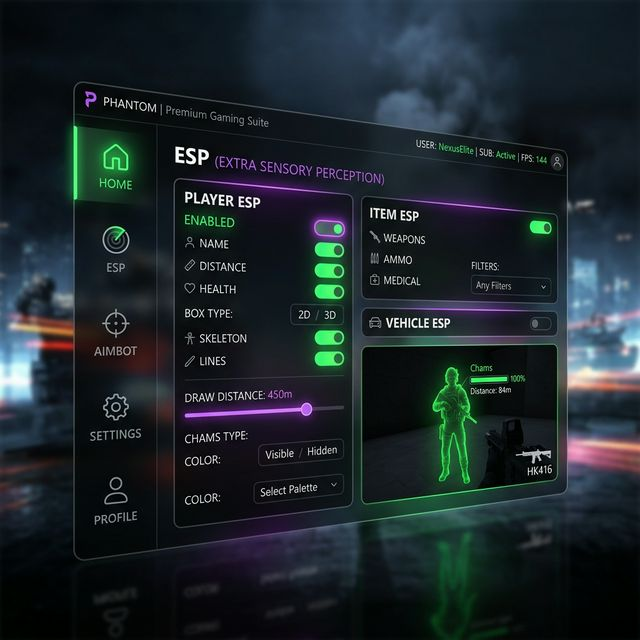
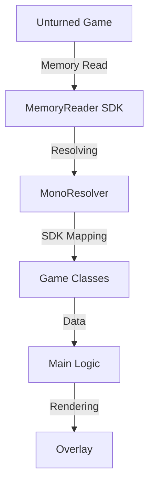

# 
👻 PHANTOM EXTERNAL - Unturned 2026

  
  
  
  

---

  <a href="#english">English</a> | <a href="#russian">Русский</a>

---

<h2 id="english">🇺🇸 English</h2>

  <b>Phantom External</b> is a high-performance, undetected external cheat for Unturned 3.x, designed with 2026 anti-cheat standards in mind. Built on a <i>Universal Mono Resolver</i> architecture, it ensures stability across multiple game updates without manual offset hunting.

  

### ✨ Key Features
- 🎯 **Advanced Aimbot**: Vector-based smoothing (Lerp) and custom FOV to look 100% human.
- 👁️ **Premium ESP**: 2D/3D boxes, Health bars, Distance, and Item names.
- 🧠 **Mono Resolver**: Dynamic runtime dissection for permanent offset stability.
- 🛡️ **Stealth Engine**: Multi-threaded memory caching and `DisplayAffinity` protection.

---

<h2 id="russian">🇷🇺 Русский</h2>

  <b>Phantom External</b> — это высокопроизводительный, незаметный внешний чит для Unturned 3.x, созданный с учетом стандартов античитов 2026 года. Построенный на архитектуре <i>Universal Mono Resolver</i>, он гарантирует стабильность даже после обновлений игры без необходимости ручного поиска оффсетов.

  

### ✨ Основные функции
- 🎯 **Продвинутый Аимбот**: Плавная наводка (Lerp) и настраиваемый FOV — выглядит на 100% как движения человека.
- 👁️ **Премиум ESP**: 2D/3D боксы, полоски здоровья, дистанция и названия предметов.
- 🧠 **Mono Resolver**: Динамическое сканирование памяти для вечной стабильности адресов.
- 🛡️ **Система скрытности**: Многопоточное кэширование памяти и работа через `DisplayAffinity` для защиты от скриншотов.

## 🏗️ Technical Architecture / Архитектура

## 🚀 Quick Start / Быстрый запуск

1. **Clone / Клонировать**: `git clone https://github.com/D1sssyaaaa/Unturned-Phantom-External.git`
2. **Build / Собрать**: Double-click / Дважды нажми на `build.bat`.
3. **Play / Играть**: Run Unturned, then run `PhantomExternal.exe`.

## 📜 Disclaimer / Отказ от ответственности
This project is for educational purposes only. / Этот проект создан исключительно в образовательных целях. Разработчик не несет ответственности за баны или другие последствия.

---

  Give a ⭐ if you liked the project! / Поставь ⭐ если проект тебе понравился!

