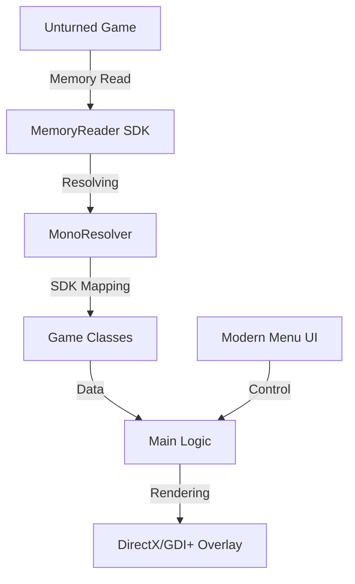

# 
👻 PHANTOM EXTERNAL - Unturned 2026

  
  
  
  

---

  <b>Phantom External</b> is a high-performance, undetected external cheat for Unturned 3.x, designed with 2026 anti-cheat standards in mind. Built on a <i>Universal Mono Resolver</i> architecture, it ensures stability across multiple game updates without manual offset hunting.

  

## ✨ Key Features

- 🎯 **Advanced Aimbot**: Vector-based smoothing (Lerp) and custom FOV to look 100% human.
- 👁️ **Premium ESP**: 2D/3D boxes, Health bars, Distance, and Item names with high-performance GDI+ rendering.
- 🧠 **Mono Resolver**: Dynamic runtime dissection of `mono-2.0-bdwgc.dll` for permanent offset stability.
- 🛡️ **Stealth Engine**: Multi-threaded memory caching and `DisplayAffinity` overlay protection against screenshots.
- 🎨 **Modern UI**: Sleek dark-mode interface with category tabs and reactive controls.

## 🚀 Quick Start (No Install Method)

To build and run **Phantom External** instantly without a heavy IDE:

1. **Clone the repo**: `git clone https://github.com/D1sssyaaaa/Unturned-Phantom-External.git`
2. **Run the Builder**: Double-click `build.bat` in the project folder.
3. **Launch Unturned**: Enter any server or local world.
4. **Execute**: Open `PhantomExternal.exe` and dominate.

## 🏗️ Technical Architecture

## 📜 Disclaimer
This project is for educational purposes only. Use of this software may result in a ban. The developer is not responsible for any consequences resulting from the use of this software.

---

  Give a ⭐ if you liked the project!

